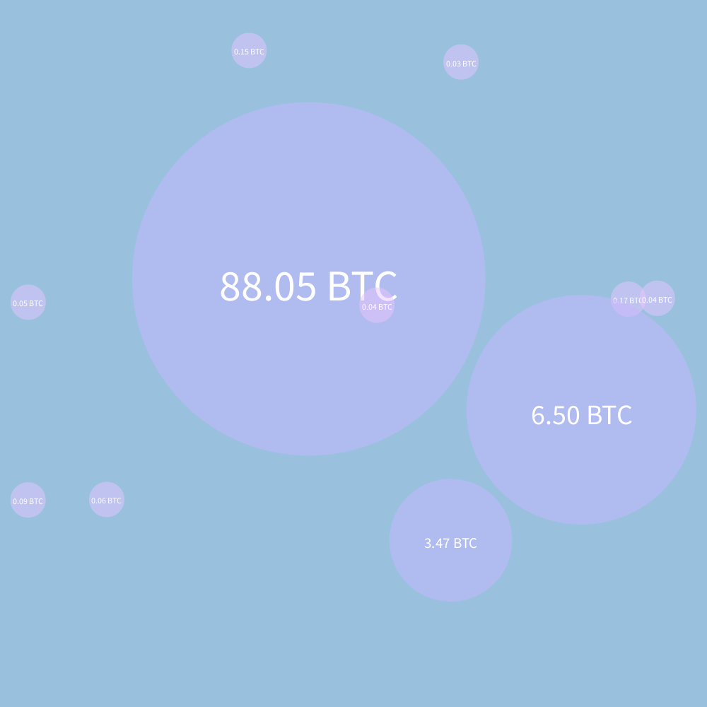

# Bitcoin Bubbles
## What is this?
This was a project created for City, University of Londons programming bootcamp (2021) in the Processing programming language as an introduction to programming.

The idea and inspiration for this project came from [BitListen](https://www.bitlisten.com/) ([source](https://github.com/MaxLaumeister/bitlisten) )

## Purpose/Features
Reads information from the blockchain using a websocket to view unconfirmed bitcoin transactions in the form of bubbles which have varying speeds, sizes and colours based on the value of the transaction.
Blocks are also displayed when a new block is found.
Sounds play with varying volume and pitch depending on the transaction. (beta).

## Preview

## Credits
* Inspiration/Idea/Some Mathematical functions - https://github.com/MaxLaumeister/bitlisten/ (Licenced under MIT)
* Processing Websocket Library - https://github.com/alexandrainst/processing_websockets (Licenced under MIT)
* Modifications to the Processing Websocket Library by ParametricCamp https://github.com/ParametricCamp/TutorialFiles/blob/master/Misc/WebSockets/procesing_websocket_client/ (Licenced under [CC BY-SA 4.0](https://creativecommons.org/licenses/by-sa/4.0)). I have made additional modifications to these to increase the maximum text limit for websockets.
* Processing Sound Library - https://github.com/processing/processing-sound/ (Licenced under GNU LGPL)
* [Blockchain API](https://www.blockchain.com/api/api_websocket)

## How to run the project from source
* Install the following libraries using the library installer in Processing: 
  * Sound (Author: The Processing Foundation)
  * Websockets (Author: Lasse Steenbock Vestergaard)
 * Open the project "FinalBootcampProject"
 * Execute the project